# Chart4D

Publication-ready editorial charts for Delphi, VCL and FireMonkey.

Chart4D draws charts the way a newsroom publishes them: a bold left-aligned title, a light
horizontal grid, no chart junk, direct labelling, and a footer with the source. One consistent
style out of the box, every part of it overridable.

Zero dependencies, RTL only in the core, in the style of the GDK 4D library family.

<!-- badges -->
[](LICENSE)
[](https://github.com/GDKsoftware/Chart4D/tags)
[](https://www.embarcadero.com/products/delphi)
[](Tests)


<p align="center">
  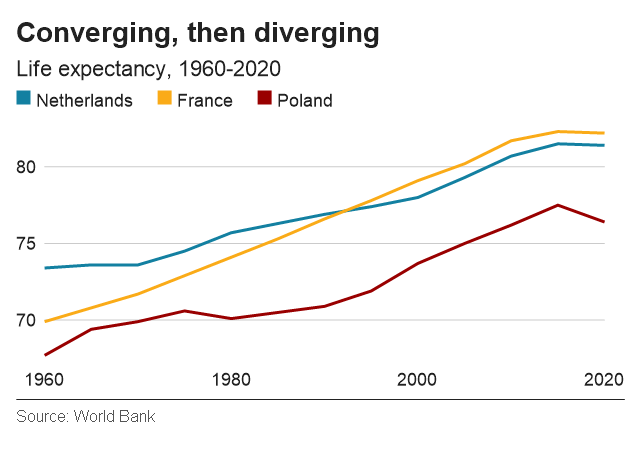
  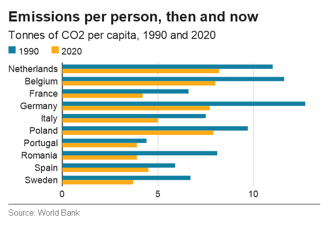
</p>

## Why Chart4D

Most charting components give you every option and leave the design to you. The result is
usually a chart that looks like a spreadsheet: a boxed plot area, a heavy grid in both
directions, a legend in a corner, values you have to look up on an axis.

Chart4D starts from the other end. You supply the data and the words. The layout, the label
placement and the colours are already decided. Override any of them when you disagree.

The core is plain Object Pascal on the RTL and does not know about VCL or FMX. The two controls
are thin adapters over one shared renderer, so a chart renders pixel-for-pixel the same on both
frameworks and exports to PNG the same way.

## Quick start

```pascal
uses
  Chart4D.Types,
  Chart4D.Style,
  Chart4D.VCL;

var Chart := TChart4D.Create(Self);
Chart.Parent := Self;
Chart.Align := alClient;

Chart.Plot.Kind := TChartKind.Bar;
Chart.Plot.Orientation := TChartOrientation.Horizontal;
Chart.Plot.Title := 'Almost everyone is online';
Chart.Plot.Subtitle := 'Share of the population using the internet, 2020';
Chart.Plot.Source := 'Source: World Bank';
Chart.Plot.Categories := ['Sweden', 'Spain', 'Belgium', 'Netherlands'];
Chart.Plot.AddSeries('2020', [94.5, 93.2, 91.5, 91.3]);

Chart.SaveToPng('online.png');
```

The FireMonkey control has the same API. Use `Chart4D.FMX` instead of `Chart4D.VCL` and
nothing else changes.

## Chart kinds

| Kind | What it is for |
|---|---|
| `Line` | A measure over time, one or more series |
| `Area` | A total that accumulates, rather than a level you measure |
| `Bar` | Ranking and comparison, for values with a meaningful zero |
| `GroupedBar` | Two or three measures per category, side by side |
| `StackedBar` | Parts of a whole, absolute or normalised to 100% |
| `Histogram` | The shape of a distribution, binned for you |
| `DotPlot` | Comparison where zero is not informative, so bars would mislead |
| `Dumbbell` | Change between two moments, one row per category |
| `Range` | The span between a low and a high value |
| `Arrow` | Change between two moments, drawn as a direction rather than two points |
| `Scatter` | Two continuous measures against each other, with optional bubble sizing |
| `Pie` | Parts of one whole, for a handful of segments |
| `Donut` | A pie with room for a total in the middle |

<table>
<tr>
<td>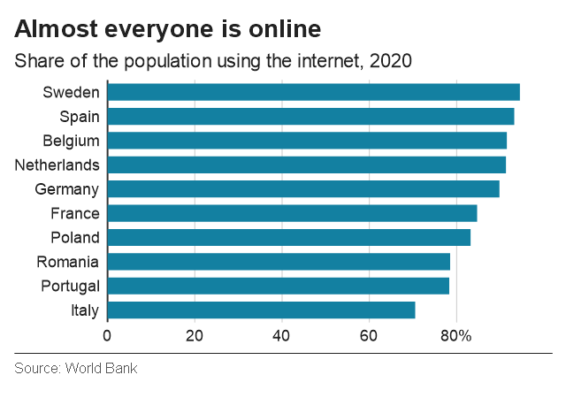</td>
<td>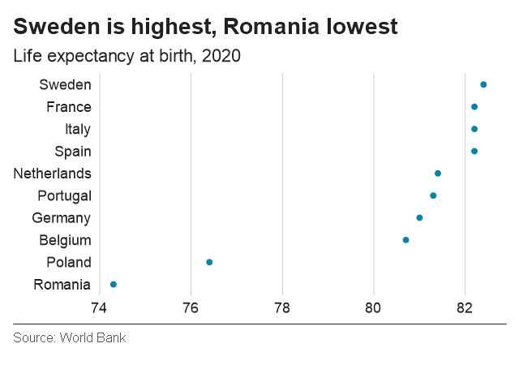</td>
</tr>
<tr>
<td>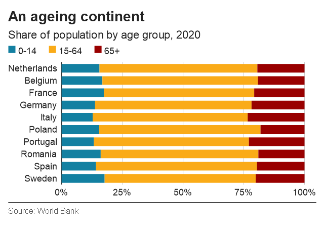</td>
<td>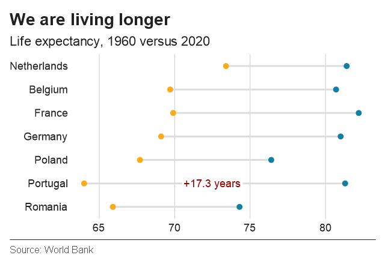</td>
</tr>
<tr>
<td>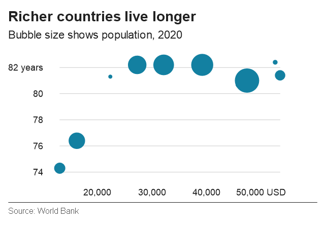</td>
<td>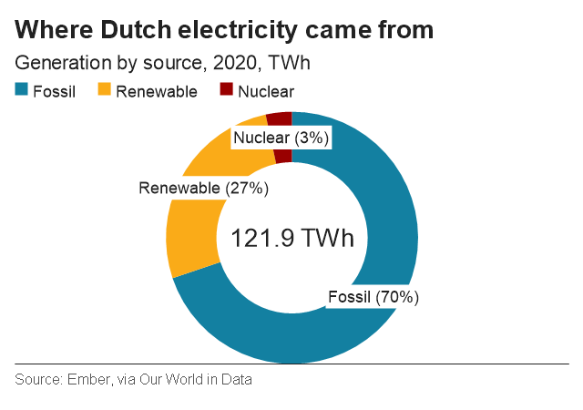</td>
</tr>
<tr>
<td>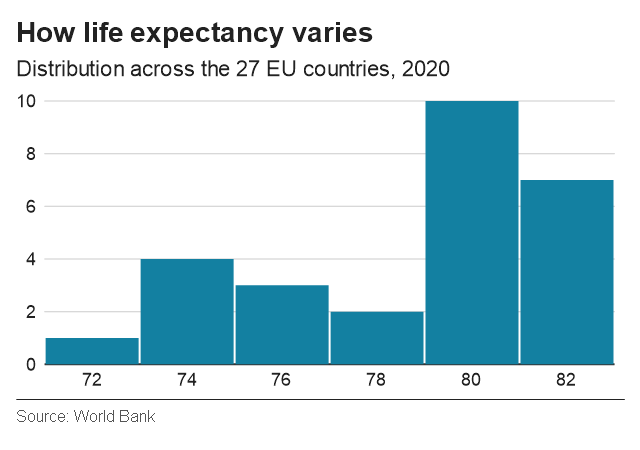</td>
<td>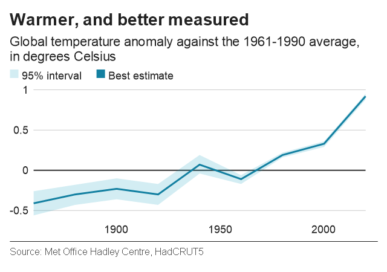</td>
</tr>
</table>

## Labelling and emphasis

Direct labelling is what makes this style readable, so it is built in rather than left to you.

```pascal
Plot.ValueLabels := TValueLabelMode.Extremes;  // None, All, FirstAndLast, Extremes
```

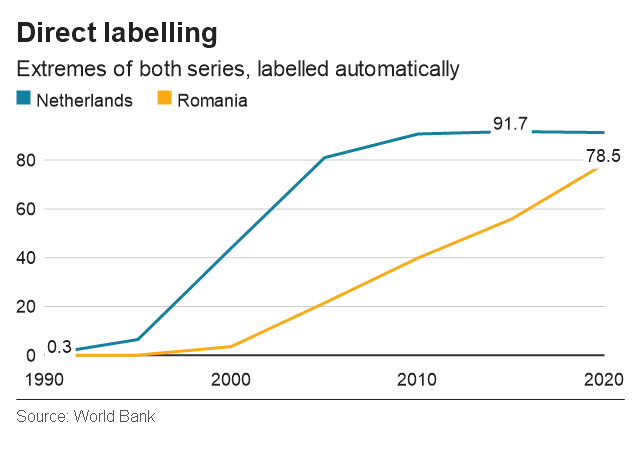

Labels are placed automatically, moved inside the plot when they would cover an axis label,
and skipped when they would collide with a label already drawn. The result is deterministic,
so a chart looks the same on every run.

Pie and donut segments label themselves, "Fossil (70%)" by default. When the legend already
names the categories, show the share alone:

```pascal
Plot.SegmentLabels := TSegmentLabelMode.Percentage;  // CategoryAndPercentage, Percentage, Category, None
```

Where two segment labels would collide, the larger segment keeps its label.

Labels sit on an opaque white box by default. The box color is part of the style, and a
transparent one puts the text straight on the ink:

```pascal
var Style := Plot.Style;
Style.LabelBackgroundColor := TAlphaColors.Null;  // no box; ChartLabelBackground restores it
Plot.Style := Style;
```

A segment label then keeps the style's text color while it reaches `MinimumTextContrast`
against its own wedge (4.5 by default, the WCAG AA level), and only below that takes
whichever of the text color and white reads better. Set it to 3 to keep dark text on
mid-tone wedges, or to 1 to never switch. Value labels and text annotations use the same
box color; the hover tooltip always keeps its white box.

To argue one point while still showing context, mute everything except one series:

```pascal
Plot.HighlightedSeriesIndex := 4;
```

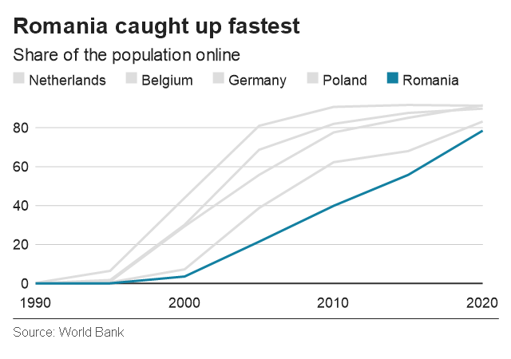

A series with an explicitly set colour keeps it, so a deliberate choice always survives.

## Axes

```pascal
var YAxis := Plot.YAxis;
YAxis.MinValue := 0;                             // NaN for automatic
YAxis.Breaks := [0, 50, 100];                    // empty for automatic
YAxis.BreakLabels := ['none', 'half', 'all'];    // one label per break; empty to format the breaks
YAxis.UseThousandSeparator := True;              // 40,000 instead of 40000
YAxis.Decimals := 1;                             // 40,000.0; AutomaticDecimals to trim
YAxis.LabelSuffix := '%';
YAxis.SuffixOnLastOnly := True;                  // the unit on the last label only
YAxis.LocaleName := 'nl-NL';                     // 40.000 for a Dutch audience
YAxis.Scale := TAxisScaleKind.Logarithmic;
Plot.YAxis := YAxis;

var XAxis := Plot.XAxis;
XAxis.DateMode := TAxisDateMode.Auto;            // days, months, quarters or years
XAxis.CategoryLabelLayout := TCategoryLabelLayout.Staggered;
Plot.XAxis := XAxis;
```

Numbers use the invariant convention unless you set `LocaleName`, so test output is
reproducible.

`Decimals` is `AutomaticDecimals` by default, which keeps up to ten decimals and drops the
trailing zeros, so `5.0` reads as `5`. Set it to a count and every number that axis
formats gets exactly that many, padded where the value has fewer: break labels, value
labels and the tooltip. `0` rounds to whole numbers. Percentages, on the proportions axis
and on pie and donut segments, stay whole until you set it, and then follow it too.

A tooltip formats its value with the value axis' `Decimals`, `UseThousandSeparator` and
`LocaleName`, so it reads as the same number the axis beside it shows.

A category label that will not fit beside its neighbour is dropped, so a crowded axis
thins itself out instead of printing on top of itself. `CategoryLabelLayout` set to
`Staggered` gives that axis a second row to try first. Ten country names on a 640 px axis
leave every neighbouring pair overlapping, so only every other one survives:

```
Netherlands  France     Italy
```

Staggered, the names it had to drop go on the row below, each still centred under its own
bar, and all ten fit:

```
Netherlands  France     Italy
       Belgium    Germany
```

A label that fits neither row is still dropped. The second row costs a line of plot
height (a column of width, on a horizontal chart), reserved whenever you ask for the
layout, so the plot does not jump about as the data or the window changes.

For a horizontal chart the value axis is still `YAxis`. The orientation swaps where the axes
are drawn, not what they mean.

## Annotations and context

```pascal
Plot.AddTextAnnotation(5, 72.5, '+17.3 years', ChartDarkRed, TTextAlignH.Center);
Plot.AddHorizontalLine(80, ChartLightGrey, True);
Plot.AddHorizontalRangeOverlay(78, 80, TAlphaColor($30990000));
Plot.AddArrow(1990, 60, 1995, 45);
```

A range band takes its bounds from data instead of the axis, for confidence intervals,
forecast ranges or a real spread:

```pascal
const Band = Plot.AddRangeBandSeries('Male to female', Years, Men, Women);
Band.Color := TAlphaColor($3013A0C1);
```

## Interaction

Both controls hit-test the chart on mouse move, highlight the nearest data point and draw a
tooltip. Tooltips are on by default.

```pascal
Chart.ShowTooltips := True;
Chart.OnDataPointHover := HandleHover;

procedure TFormMain.HandleHover(Sender: TObject; const Info: TChartHitInfo);
begin
  if Info.HasHit then
    Caption := Format('%s: %s', [Info.CategoryLabel,
                                 TAxisScale.FormatValue(Info.Value, False)]);
end;
```

`SaveToPng` never draws a tooltip, so an export is always clean.

## Painting on your own canvas

`TChart4D` is not the only way to put a plot on screen. When you already have a canvas, say a
`TPaintBox` in an existing viewer, a `TChartPainter` paints any `TChartPlot` onto it with the
same back buffer, hover highlight and tooltip the control uses.

```pascal
uses
  Chart4D.Plot,
  Chart4D.VCL;

FPlot := TChartPlot.Create;
FPainter := TChartPainter.Create(FPlot);
FPainter.View.OnRepaintRequest := PainterRepaintRequest;

procedure TFormViewer.PaintBoxPaint(Sender: TObject);
begin
  FPainter.Paint(PaintBox.Canvas, PaintBox.Width, PaintBox.Height);
end;

procedure TFormViewer.PaintBoxMouseMove(Sender: TObject; Shift: TShiftState; X, Y: Integer);
begin
  FPainter.MouseMove(X, Y);
end;

procedure TFormViewer.PaintBoxMouseLeave(Sender: TObject);
begin
  FPainter.MouseLeave;
end;

procedure TFormViewer.PainterRepaintRequest(Sender: TObject);
begin
  PaintBox.Invalidate;
end;
```

When the chart shares the canvas with other content, paint it into a rectangle instead. It is
laid out for that rectangle's size, and nothing is drawn outside it. `MouseMove` then still
takes canvas coordinates; a position outside the rectangle counts as leaving the chart.

```pascal
FPainter.Paint(PaintBox.Canvas, TRect.Create(200, 0, PaintBox.Width, PaintBox.Height));
```

The painter does not own the plot: free the painter first, then the plot. It takes over
`Plot.OnChanged` so that every change repaints. `FPainter.View` also carries `ShowTooltips` and
`OnDataPointHover`. In FireMonkey, `Chart4D.FMX` has a `TChartPainter` with the same shape;
call its `Paint` from `OnPaint`, passing the `ARect` it receives, and map `OnRepaintRequest`
to `Repaint`.

## Export

```pascal
Chart.SaveToPng('chart.png');            // 640x450 by default
Chart.SaveToPng('large.png', 1280, 900);
```

The publication footer is part of the export: the source text on the left, an optional logo on
the right, separated from the chart by a full-width rule.

```pascal
Plot.Source := 'Source: World Bank';
Plot.LogoFilePath := 'logo.png';
```

The logo is scaled to fit the footer height and aligned right. Both demos set it to
`assets\chart4d-mark-64.png`, so you can see what it looks like without wiring anything up.

## Style

`TChartStyle.Default` holds the editorial style: Helvetica, or Arial on Windows, a 28 pixel
bold title, a 22 pixel subtitle, 18 pixel legend and axis text in `#222222`, gridlines on the
value axis only in `#CBCBCB`, and no axis titles, ticks or axis lines. Sizes are pixels at the
640x450 reference size and scale with `ScaleFactor`.

```pascal
var Style := Plot.Style;
Style.TitleFontSize := 32;
Style.ShowGridlines := False;
Style.ScaleFactor := 2.0;
Plot.Style := Style;
```

The palette:

```pascal
ChartBlue         = TAlphaColor($FF1380A1);
ChartOrange       = TAlphaColor($FFFAAB18);
ChartDarkRed      = TAlphaColor($FF990000);
ChartGreen        = TAlphaColor($FF588300);
ChartBaselineGrey = TAlphaColor($FF333333);
ChartLightGrey    = TAlphaColor($FFDDDDDD);
```

## Installation

Open the packages under `packages\RAD Studio 13.0\` or `packages\RAD Studio 12.0\`,
whichever matches your IDE, and build `Chart4D_R` for the core, then `Chart4D_VCL_R` or
`Chart4D_FMX_R` for the framework you use.

To get `TChart4D` on the component palette, install `Chart4D_VCL_D` or `Chart4D_FMX_D` as
well: right-click the project and choose Install. Both appear on a palette page named
Chart4D. Add `packages\dcp\Win32\Release` to the library path so your own projects find the
compiled units.

Running the IDE as a 64-bit process? Build the runtime and design packages for Win64x
first, which is what `Build.bat` does when your Delphi has that platform, and install the
design packages from there.

Or skip the packages and add `Source\` plus `Source\VCL\` or `Source\FMX\` to your project
search path, then create the control in code.

### In the designer

Drop a `TChart4D` on a form and the Object Inspector carries the settings that hold a
single value: `Kind`, `Title`, `Subtitle`, `Source`, `Orientation`, `StackMode`,
`LegendPosition`, `LegendReversed`, `ValueLabels`, `HighlightedSeriesIndex`,
`DonutCenterText` and `ShowTooltips`. Each one mirrors the property of the same name on
`Plot`, so setting it in the designer and setting it in code do the same thing.

Series, categories and annotations stay in code. They are lists rather than single values
and do not stream to a DFM, so a control with an empty plot draws a sample chart in the
designer instead: your title, your chart kind and your legend, with placeholder data, so
you can see the layout before the first line of code runs. The moment your own plot has a
series, the sample is gone.

## Demos

`Examples\VCL` and `Examples\FMX` both run every example in the catalogue, with the
explanation and the code that produces it beside the chart. They share
`Examples\Common\Chart4DDemo.Catalog.pas`, so the fragment on screen and the chart next to it
always come from the same source.

Build them with `Build.bat` in the repository root. The script picks the newest installed
Delphi; set `CHART4D_STUDIO` to `23.0` or `37.0` to force Delphi 12 or Delphi 13.

All demo data is published World Bank World Development Indicators data. Two exceptions: the
electricity mix is Ember data via Our World in Data, and the temperature anomaly is HadCRUT5
from the Met Office Hadley Centre.

## Verification

`Build.bat` builds the three runtime packages and the two design-time ones, runs the DUnitX
suite for Win32 and Win64, and builds both demos. Everything compiles with zero warnings
and zero hints.

Three console tools under `Tools\` go further:

| Tool | What it checks |
|---|---|
| `CoreCheck` | Every core unit compiles and every scenario renders |
| `VclCheck` | The GDI+ adapter renders, exports and reports hover, the design-time preview draws, and every published property survives a DFM round trip |
| `FmxCheck` | The same for FMX, plus every chart kind drawing real pixels |

`FmxCheck` and `VclCheck` drive the control's own mouse handling, so the chain from a mouse
move through the hit test to the repaint is covered, not just the geometry behind it.

## Status

Version 1.2.0. See [SPEC.md](SPEC.md) for the design contract and
[CONTRIBUTING.md](CONTRIBUTING.md) for how to build, test and submit a change.

## License

Chart4D is released under the [MIT License](LICENSE).

Copyright (c) 2026 GDK Software

## Commercial Support

For companies we offer a support and maintenance contract, including sponsored development of
the features you need. Get in touch at
[gdksoftware.com/contact-us](https://gdksoftware.com/contact-us), or open an issue.

## About GDK Software

Chart4D is developed by [GDK Software](https://gdksoftware.com), a software company building
Delphi developer tools, MCP integrations, and enterprise Delphi applications.
